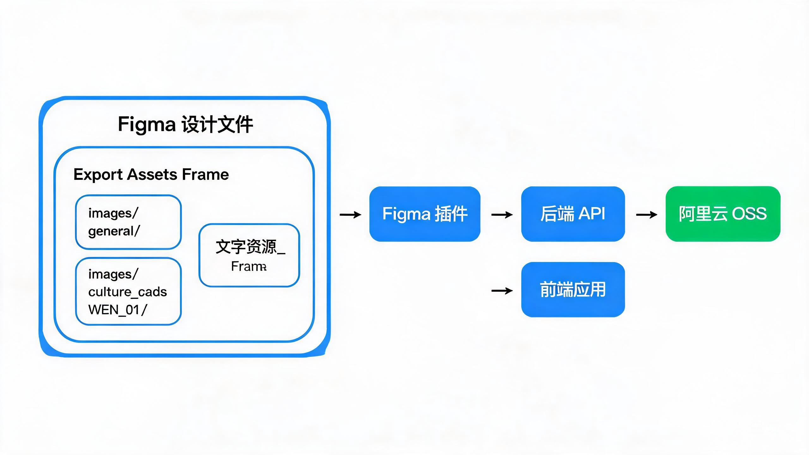
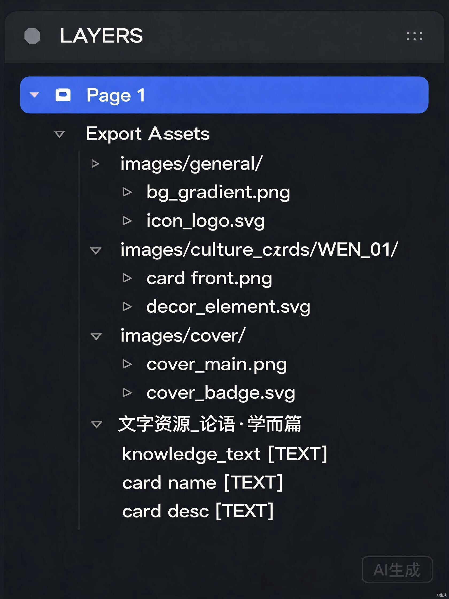
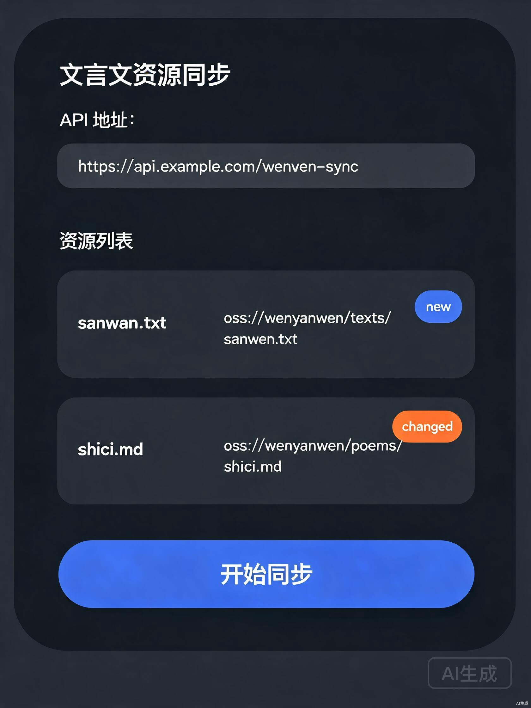

# 文言文预习平台 - Figma 资源同步插件使用说明书

> 版本：1.0.0 | 更新日期：2026-08-06

---

## 一、插件概述

**文言文资源同步插件** 是一个 Figma 插件，用于将 Figma 设计文件中的图片和文字资源一键同步到阿里云 OSS，供前端应用直接使用。

### 1.1 核心功能

| 功能 | 说明 |
|------|------|
| 图片资源导出 | 扫描 `Export Assets` Frame，导出子 Frame 中的图层为 PNG/SVG，按 Frame 命名上传到 OSS |
| 文字资源导出 | 扫描 `文字资源_` Frame，读取 TEXT 节点内容生成 JSON 文件，上传到 OSS |
| 增量同步 | 后端 MD5 比对，相同内容跳过，仅上传变更文件 |
| 版本管理 | 自动更新 `version.json`，前端通过 `?t=timestamp` 刷新缓存 |

### 1.2 管线架构



*图 1：整体管线架构 — 从 Figma 设计文件到前端应用的完整数据流*

---

## 二、安装插件

### 2.1 前置条件

- **Figma 桌面版**（推荐）或 Figma 网页版
- **插件代码**：从代码仓库获取 `figma-plugin/` 目录

### 2.2 安装步骤

1. 打开 Figma 桌面版
2. 点击顶部菜单 **Plugins（插件）** → **Development（开发）** → **Import plugin from manifest（从清单导入插件）**
3. 在文件选择器中，选择仓库中的 `figma-plugin/manifest.json` 文件
4. 插件安装成功后，会在 **Plugins → Development** 下出现 **文言文资源同步**

### 2.3 验证安装

- 打开任意 Figma 文件
- 右键画布 → **Plugins → Development → 文言文资源同步**
- 应看到插件面板弹出，显示"正在扫描当前文件中的资源..."

---

## 三、Figma 文件结构约定

> **这是最关键的部分**：插件根据 Frame 命名自动识别资源类型和 OSS 路径。

### 3.1 文件结构概览



*图 2：Figma 图层面板中的文件结构示例*

### 3.2 通用组件文件

通用组件文件包含全局资源（如首页背景、登录背景、图标等），**只有 Export Assets Frame，没有文字资源 Frame**。

```
Page 1
├── Export Assets（顶层 Frame，名称固定）
│   ├── images/general/         ← 子 Frame 名 = OSS 路径
│   │   ├── home_bg.png         ← 图层名 = 文件名
│   │   ├── login_bg.png
│   │   └── logo.svg
│   ├── images/cover/
│   │   └── cover_main.png
│   └── audio/                  ← 音频标注（大文件不走插件导出）
│       └── bgm.mp3
```

### 3.3 课文文件

每个课文一个独立的 Figma 文件，**同时包含 Export Assets 和 文字资源_ Frame**。

```
Page 1
├── Export Assets（顶层 Frame，名称固定）
│   ├── images/culture_cards/WEN_01/
│   │   ├── card_bg.png
│   │   ├── card_1.png
│   │   └── card_2.svg
│   └── images/cover/
│       └── cover_lesson.png
│
└── 文字资源_论语·学而篇（顶层 Frame，前缀固定）
    ├── knowledge_text           ← TEXT 节点，name = JSON 字段名
    ├── card_name                ← TEXT 节点
    ├── card_desc                ← TEXT 节点
    └── sub_data（子 Frame，name = JSON 子对象名）
        ├── sub_field_1          ← TEXT 节点
        └── sub_field_2          ← TEXT 节点
```

### 3.4 命名规则速查表

| Frame 名称 | 类型 | 导出产物 | OSS 路径示例 |
|-----------|------|---------|-------------|
| `Export Assets` | 固定名称，图片容器 | 子 Frame 中的图层导出为 PNG/SVG | 子 Frame 名决定路径 |
| `images/general/` | 子 Frame | 内部图层导出为图片 | `images/general/home_bg.png` |
| `images/culture_cards/WEN_01/` | 子 Frame | 内部图层导出为图片 | `images/culture_cards/WEN_01/card_bg.png` |
| `images/cover/` | 子 Frame | 内部图层导出为图片 | `images/cover/cover_main.png` |
| `文字资源_论语·学而篇` | 顶层 Frame | 读取 TEXT 节点生成 JSON | `data/texts/文字资源_论语·学而篇.json` |

### 3.5 图层命名规则

- **图片图层**：`{文件名}.{扩展名}`，支持扩展名：`png`、`jpg`、`jpeg`、`gif`、`webp`、`svg`
- **文字节点**：`{字段名}`，节点的 name 作为 JSON 字段的 key，characters 作为 value
- **隐藏图层**：`visible = false` 的图层会被自动跳过
- **不支持的类型**：`TEXT`、`LINE`、`STAR`、`POLYGON` 等非可导出类型会被跳过
- **无扩展名图层**：图层名不含图片扩展名会被跳过

---

## 四、使用插件

### 4.1 启动插件

1. 在 Figma 中打开目标文件（通用组件文件或课文文件）
2. **右键画布** → **Plugins → Development → 文言文资源同步**
3. 插件自动扫描当前页面的所有资源

### 4.2 插件界面说明



*图 3：插件主界面布局*

| 区域 | 说明 |
|------|------|
| **标题栏** | 显示插件名称和简要说明 |
| **API 地址** | 后端 API 地址（默认 `https://api.classicalab.cn`） |
| **状态栏** | 显示扫描结果数量和当前状态 |
| **资源列表** | 列出所有扫描到的资源，显示文件名、路径和变更状态 |
| **操作按钮** | "开始同步" 和 "取消" 按钮 |
| **结果汇总** | 同步完成后显示上传成功/跳过/失败统计 |

### 4.3 资源状态说明

| 状态标签 | 含义 | 颜色 |
|---------|------|------|
| **新增** | 新资源，尚未上传过 | 绿色 |
| **变更** | 资源内容有变化 | 黄色 |
| **未变** | 资源内容无变化，跳过上传 | 灰色 |
| **已上传** | 同步成功后显示 | 绿色 |
| **失败** | 上传失败 | 红色 |

### 4.4 同步流程

```
1. 打开 Figma 文件
    ↓
2. 运行插件（自动扫描）
    ↓
3. 确认资源列表（检查变更项）
    ↓
4. 配置 API 地址（如需修改）
    ↓
5. 点击"开始同步"
    ↓
6. 等待上传完成
    ↓
7. 查看结果汇总
    ↓
8. 关闭插件
```

### 4.5 执行同步

1. 插件扫描完成后，查看资源列表确认变更内容
2. 如需修改 API 地址，在输入框中更新（默认使用生产环境）
3. 点击 **"开始同步"** 按钮
4. 等待进度条完成
5. 查看结果汇总：
   - **已上传**：新上传的资源数量
   - **已跳过**：未变更的资源数量（MD5 相同）
   - **失败**：上传失败的资源及错误详情
6. 如有失败项，根据错误信息排查后重试

---

## 五、后端 API 说明

### 5.1 接口列表

| 方法 | 路径 | 说明 |
|------|------|------|
| POST | `/api/assets/upload` | 接收资源上传（支持图片和文字 JSON） |
| GET | `/api/assets/version` | 获取版本信息 |
| POST | `/api/assets/pre-signed` | 生成 OSS 预签名 URL（直传模式） |

### 5.2 上传格式

**图片资源**（multipart/form-data）：
```
files: 图片二进制文件
ossPath: OSS 路径（如 images/general/home_bg.png）
type: image
```

**文字资源**（application/json）：
```json
{
  "files": [{
    "ossPath": "data/texts/文字资源_论语·学而篇.json",
    "type": "text",
    "content": "{\"knowledge_text\":\"论语是儒家经典...\"}",
    "encoding": "utf-8"
  }]
}
```

---

## 六、日志与调试

### 6.1 查看日志

插件运行日志输出在 Figma 的开发者控制台中：

1. 在 Figma 中点击顶部菜单 **Plugins → Development → Open Console**
2. 运行插件，查看控制台输出

### 6.2 日志级别

| 级别 | 前缀 | 用途 |
|------|------|------|
| `[调试]` | `[文言文同步][调试]` | 详细扫描过程，每个节点的处理状态 |
| `[信息]` | `[文言文同步][信息]` | 关键流程节点，如扫描完成、上传成功 |
| `[警告]` | `[文言文同步][警告]` | 可忽略的异常，如未找到特定 Frame |
| `[错误]` | `[文言文同步][错误]` | 需要处理的错误，如上传失败 |

### 6.3 常见日志解读

```
[文言文同步][信息] ===== 开始扫描 =====
[文言文同步][信息] 当前文件页面: 论语·学而篇
[文言文同步][调试] 查找 Export Assets Frame...
[文言文同步][信息] 找到 Export Assets Frame，开始扫描子节点
[文言文同步][调试] scanExportAssetsFrame: 共 2 个子节点
[文言文同步][调试]   [1/2] 处理目录 "images/culture_cards/WEN_01/" → OSS "images/culture_cards/WEN_01" (3 个子节点)
[文言文同步][调试]     → [命中] RECTANGLE → "images/culture_cards/WEN_01/card_bg.png"
[文言文同步][调试]     → [命中] RECTANGLE → "images/culture_cards/WEN_01/card_1.png"
[文言文同步][调试]     → [命中] VECTOR → "images/culture_cards/WEN_01/card_2.svg"
[文言文同步][调试]     → 目录 "images/culture_cards/WEN_01/" 处理完成: 3 命中, 0 跳过
[文言文同步][信息] Export Assets 扫描完成，找到 3 个图片资源
[文言文同步][信息] ===== 扫描完成: 共 4 个资源（3 图片 + 1 文字） =====
```

---

## 七、常见问题

### Q1: 插件扫描结果为 0 个资源

**可能原因**：
- 当前文件中没有 `Export Assets` 或 `文字资源_` 命名的 Frame
- Frame 名称拼写错误（注意大小写和空格）
- 子 Frame 中的图层缺少有效扩展名（需 `.png`、`.svg` 等）

**解决方法**：按第三章节的命名约定创建 Frame。

### Q2: 上传失败

**可能原因**：
- API 地址配置错误
- 后端服务未运行
- 网络问题

**解决方法**：
1. 检查 API 地址是否正确（默认 `https://api.classicalab.cn`）
2. 在浏览器中访问 `https://api.classicalab.cn/api/health` 确认后端健康
3. 查看 Figma 控制台日志获取详细错误信息

### Q3: 同步后前端未显示更新

**原因**：前端通过 `?t=timestamp` 参数缓存资源，同步后 version.json 更新，前端自动刷新。

**解决方法**：
1. 确保后端 version.json 已更新（可在同步结果中查看）
2. 硬刷新浏览器页面（Ctrl + F5 / Cmd + Shift + R）
3. 清除浏览器缓存

### Q4: 如何在多个文件中使用同一个插件？

插件是通用的，**同一个插件可在任意 Figma 文件中使用**：
- 通用组件文件：扫描 Export Assets → 上传到 images/general/ 等
- 课文文件：扫描 Export Assets + 文字资源_ → 上传到对应路径
- 插件根据 Frame 命名自动路由到正确的 OSS 路径

### Q5: 大文件（音频/视频）如何处理？

音频、视频等大文件**不走 Figma 插件导出**，应直接上传到阿里云 OSS：
1. 手动上传到 OSS 对应目录（`audio/`、`video/`）
2. 前端通过 `VITE_OSS_BASE_URL` 拼接地址访问
3. 在 Figma 中可以用同名 Frame 做标注，插件会跳过大文件类型

---

## 八、开发与维护

### 8.1 本地构建

```bash
# 进入插件目录
cd figma-plugin

# 安装依赖
npm install

# 类型检查
npm run type-check

# 构建（code.ts → code.js）
npm run build

# 监听模式（开发时自动编译）
npm run watch
```

### 8.2 项目文件结构

```
figma-plugin/
├── manifest.json          # Figma 插件清单
├── code.ts                # 插件主逻辑（TypeScript 源码）
├── code.js                # 编译后的 JavaScript（构建产物）
├── ui.html                # 插件 UI 界面
├── package.json           # 构建配置
├── tsconfig.json          # TypeScript 配置
├── package-lock.json      # 依赖锁文件
└── __tests__/
    └── mock-test.ts       # 模拟测试脚本
```

### 8.3 CI/CD 集成

当 `figma-plugin/` 目录有变更时，GitHub Actions 自动执行：

| Workflow | 触发条件 | 执行内容 |
|---------|---------|---------|
| **CI Checks** | 推送 `figma-plugin/**` | 类型检查 + 构建验证 |
| **Deploy Backend to Test Server** | 推送 `figma-plugin/**` 到 `feature-1` | 重新部署后端服务 |

---

## 九、附录：模拟测试

### 9.1 测试场景

插件提供了 4 个模拟测试场景，用于验证节点解析逻辑：

| 场景 | 说明 | 预期资源数 |
|------|------|-----------|
| 通用组件文件 | Export Assets + 通用图片 | 4 个图片 |
| 课文文件 | Export Assets + 文字资源 | 5 个资源（4 图片 + 1 文字） |
| 空文件 | 无任何资源 Frame | 0 个资源 |
| 仅文字文件 | 只有文字资源 Frame | 1 个文字资源 |

### 9.2 运行测试

```bash
cd figma-plugin
npm install
npm run build   # 编译 code.ts
```

测试脚本 `__tests__/mock-test.ts` 可在浏览器 Console 或 Node.js 中运行，验证扫描逻辑是否正确。

---

## 修订记录

| 日期 | 版本 | 变更内容 |
|------|------|---------|
| 2026-08-06 | 1.0.0 | 初始版本 |