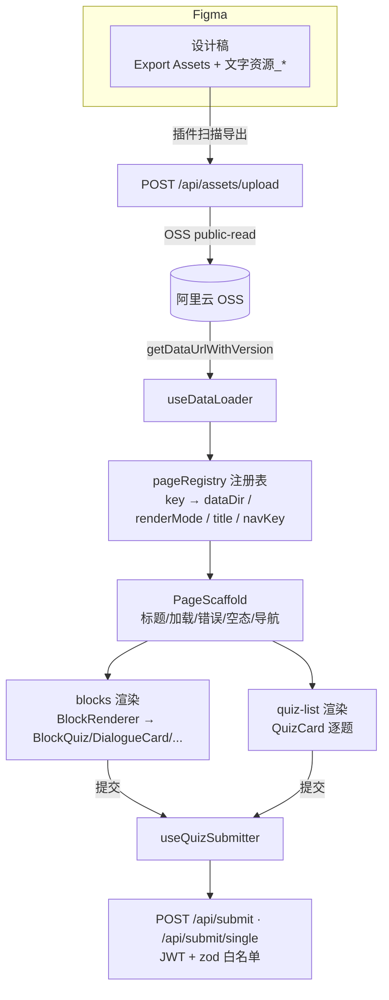

# Figma 页面注册表 + PageScaffold 设计草案

> 状态：部分实现（pageRegistry.ts / PageScaffold.vue 已于 P1 落地并接入 StepTwo/StepThree），
> 本文档固化设计意图与扩展规范，供后续新增 Figma 页面与接手同学参照。
> 关联代码：`src/config/pageRegistry.ts`、`src/components/PageScaffold.vue`、`src/utils/useQuizSubmitter.ts`、`src/composables/useQuizProgress.ts`

---

## 一、背景与目标

生产前端（Vue3 + Vite）与 Figma 插件链路并存：

```
[Figma 插件] 扫描 Export Assets（图片）+ 文字资源_*（JSON）
    ↓ POST /api/assets/upload（ASSET_SYNC_TOKEN 鉴权）
[后端] MD5 比对 → OSS（public-read）→ 更新 version.json
    ↓ VITE_OSS_BASE_URL + ?t=lastSyncAt
[前端] useDataLoader（LRU 缓存 + Worker 解析）
```

问题：此前"由 Figma 上传数据驱动的页面"（StepTwo/StepThree）把数据目录、标题、渲染方式
硬编码在各自视图里，新增一个 Figma 页面就要新开视图 + 路由 + 重复实现"加载/错误/进度/提交/导航"骨架。

**目标：**
1. **注册表驱动**：页面元信息（数据目录/渲染模式/标题/导航 key）收敛到 `pageRegistry.ts`，新增页面零代码接入（注册一条即可）。
2. **骨架复用**：加载/错误/空态/底部导航统一由 `PageScaffold` 承载，页面只关心内容区渲染。
3. **行为标准化**：提交统一走 `useQuizSubmitter`，完成记录统一走 `quizCompletionStorage`，questionId 统一走 `resolveQuestionId`。

---

## 二、整体架构



---

## 三、数据契约（Figma JSON 约定）

页面数据按课文落盘：`OSS data/{dataDir}/{wenId}.json`。

- **blocks 模式**（对应 `pages_level2_dialog_quiz/*`）：

```json
{
  "pageId": "level2_dialog_quiz",
  "title": "课文研读",
  "blocks": [
    { "type": "dialogue", "data": { "textId": "WEN_01" } },
    { "type": "quiz",     "data": { "text_id": "WEN_01", "question_id": "q1",
                                    "question_text": "...", "option_a": "...",
                                    "correct_answer": 0, "difficulty": "L2" } }
  ]
}
```

- **quiz-list 模式**（对应 `pages_level3_adaptive_quiz/*`）：

```json
{
  "pageId": "level3_adaptive_quiz",
  "items": [
    { "text": "情景文本...", "quiz": { "question_id": "1", "module": "C",
                                       "question_text": "...", "options": [],
                                       "correct_answer": 0, "explanation": "..." } }
  ]
}
```

前端字段适配统一走 `src/adapters/`：`quizAdapter.adaptBlockQuizToQuizItem`（Block 模式）、
`level1/2/3QuizAdapter`（传统模式）。**Figma 新页面如需新字段，应在适配器层做 schemaVersion 兼容，不在页面组件里铺散。**

---

## 四、pageRegistry（Figma 页面注册表）

### 4.1 数据结构

```ts
export type FigmaRenderMode = 'blocks' | 'quiz-list'

export interface FigmaPageMeta {
  key: string                 // 页面逻辑 key，全局唯一
  dataDir: string             // OSS/本地数据目录 /data/{dataDir}/{wenId}.json
  renderMode: FigmaRenderMode
  title: string               // 页面标题（兜底展示）
  navKey: RouteName           // 对应页面序列 useNavigation key
  requiresAuth: boolean       // 是否要求登录（路由 meta）
}
```

### 4.2 已注册页面

| key | dataDir | renderMode | 消费视图 |
|---|---|---|---|
| `steptwo` | `pages_level2_dialog_quiz` | blocks | StepTwoView |
| `stepthree` | `pages_level3_adaptive_quiz` | quiz-list | StepThreeView |

### 4.3 新增 Figma 页面清单（零代码接入步骤）

1. Figma 文件创建顶层 Frame：`文字资源_{renderDir}_{pageKey}`（如 `文字资源_pages_new_quiz`）→ 插件上传为 `data/pages_new_quiz/{wenId}.json`；
2. `pageRegistry.ts` 注册一条：`newQuiz: { key, dataDir: 'pages_new_quiz', renderMode: 'blocks', title, navKey, requiresAuth }`；
3. 若渲染模式是已有模式（blocks/quiz-list）→ 复用现有视图或 `FigmaPageView`；
4. 若需独立路由与页面序列插入：`router/index.ts` 注册路由 + `config/navigation.ts` 的 `pageSequence` 插入位置；
5. block 类型为新增语义时，先在 `BlockRenderer.vue` 的 componentMap 注册渲染组件（建议组件 ≥ 2 词、放 `src/components/`）。

### 4.4 演进方向

- **`FigmaPageView.vue` 通用页**：把 StepTwo/StepThree 的"按 meta 分发渲染器"下沉为单一视图（路由 `/figma-page/:pageKey/:id`），彻底消除"每模式开视图"；
- **schemaVersion**：Figma JSON 顶层加 `schemaVersion`，适配器按版本迁移，避免字段演进破坏历史数据。

---

## 五、PageScaffold（页面骨架容器）

### 5.1 Props / Events / Slots

```ts
interface Props {
  title?: string          // 页面标题（header 默认渲染，朱红底色卡片）
  subtitle?: string       // 副标题
  loading: boolean        // 加载态 → BaseLoader
  error: string | null    // 错误态 → BaseError（@retry）
  isEmpty?: boolean       // 空态 → BaseEmpty 或 empty slot
  loadingText?: string
  emptyText?: string
  showNavigation?: boolean // 是否渲染 BackContinue
  showContinue?: boolean   // 传给 BackContinue 的"继续"显隐
  backText?: string
  continueText?: string
}
defineEmits<{ (e: 'retry'): void; (e: 'back'): void; (e: 'continue'): void }>()
// slots: default（内容区）、header（自定义标题）、empty（自定义空态）
```

### 5.2 渲染优先级

```
loading → BaseLoader
error → BaseError(@retry)
isEmpty → 空态（empty slot / BaseEmpty）
else → <slot /> 内容区
始终 → BackContinue（showNavigation 时）
```

### 5.3 使用约定

- **页面只写内容区**：进度条、测验列表、完成态、文化卡片等留在 default slot；
- 页面保留自己的外层容器 class 控制页宽/内边距，PageScaffold 仅保证底部导航安全距离；
- 进度/完成/提交等行为由页面组合 `useQuizProgress` + `useQuizSubmitter` 完成，不进入 Scaffold（保持骨架无状态）。

---

## 六、行为层标准化（配套规范）

| 关注点 | 统一入口 | 说明 |
|---|---|---|
| 单题/批量提交 | `useQuizSubmitter` | 学生身份统一注入，组件禁止直调 apiService.submit* |
| 逐题进度 | `useQuizProgress` | 内部经 useQuizSubmitter 提交 |
| questionId | `resolveQuestionId` | 数据源 question_id 优先，缺失 `{wenId}_q{n}` 兜底 |
| 完成记录 | `quizCompletionStorage` | localStorage 持久化，key 含学生维度 |
| 页面元信息 | `getFigmaPageMeta` | 数据目录/标题/渲染模式唯一来源 |

---

## 七、风险与注意

1. **新增页面渲染模式**：目前仅 blocks/quiz-list 两种；新模式需扩展 `FigmaRenderMode` 并在消费端新增渲染分支（注册表不自动解决渲染器）。
2. **Figma 字段演变**：字段更名会影响适配器与 JSON，建议推进 schemaVersion。
3. **多环境数据**：OSS test/prod 桶需按用例分别上传对应数据 JSON，version.json 时间戳保证缓存刷新。
4. **鉴权**：注册表 `requiresAuth` 与路由 `meta.requiresAuth` 需保持一致，否则登录守卫与数据访问不一致。

---

## 八、Figma 切片资源消费约定（生产桶）

生产桶（`www.classicalab.cn`）现网资源路径约定：

```
images/screens/{wenId}/{screenType}/{fileName}
  ├── dialogue/     btn_back/btn_next、bgm-controller、avatar_*、card_bamboo、bg_mountain
  ├── quiz/         option_a~d、btn_submit、grade_area、btn_completed
  ├── video/        video_placeholder、article_bg
  ├── summary/      summary_text_box、bg_summary
  ├── explanation/  article_title 等
```

代码侧消费入口：[figmaAssets.ts](../src/config/figmaAssets.ts)

- `getScreenAssetUrl(wenId, screenType, fileName)` —— 按约定构造完整 URL
- `resolveScreenAsset(wenId, screenType, fileName)` —— HEAD 探测存在后返回 URL，否则 `null`
- 组件统一采用"**图优先 / CSS 兜底**"：`resolveScreenAsset` 命中即渲染切片，未命中保持现有 design-tokens 样式
- 已接入：`DialogueCard` 头像（`icon_dialog` 优先 `images/screens/{wenId}/dialogue/{name}`，缺失回退 `images/{name}`，再缺显示默认图标）

### 需要 Figma 插件补传的资源清单（数据层断点）

| # | 资源 | 目标路径 | 说明 |
|---|---|---|---|
| D1 | WEN_01 对话图标 | `images/screens/WEN_01/dialogue/WEN_01_icon_dialog*.png` | 生产/测试桶均 404，组件已按此目录解析 |
| D2 | WEN_08/16/17/18/19 等课文 block JSON | `data/pages_level2_dialog_quiz/{wenId}.json`、`data/pages_level3_adaptive_quiz/{wenId}.json` 等 | 前端页面数据载体，目前仅 WEN_01 存在 |
| D3 | 课文基础/字词/文化数据 | `data/text_basic_info/`、`data/word_list/`、`data/culture_cards/` | 与 D2 一起补齐 |
| D4 | 对话角色头像等在 blocks 中引用 | 数据 block `icon_dialog`/`image` 字段指向 `images/screens/{wenId}/dialogue/avatar_*.png` | 直接引用现网已上传切片即可 |

> 说明：切片图已大量在生产桶（WEN_08/18 全流程，共 376 张），**数据 JSON 是图被消费的前提**。数据补齐后，已在组件层接通的通道会直接呈现 Figma 效果。

### 视觉取舍（本次确认）

- **对话头像/图标**：用 Figma 切片图（已接通，补传即可显示）
- **测验选项/提交/成绩区**：当前为 CSS 实现；如需材质还原，在数据 block 上声明 `image` 引用后由组件渲染切片（后续按课文试点）
- **样式层**：桶内 styles JSON 为 0，视觉统一由 `design-tokens.css` 维护，不从 Figma 同步样式 JSON